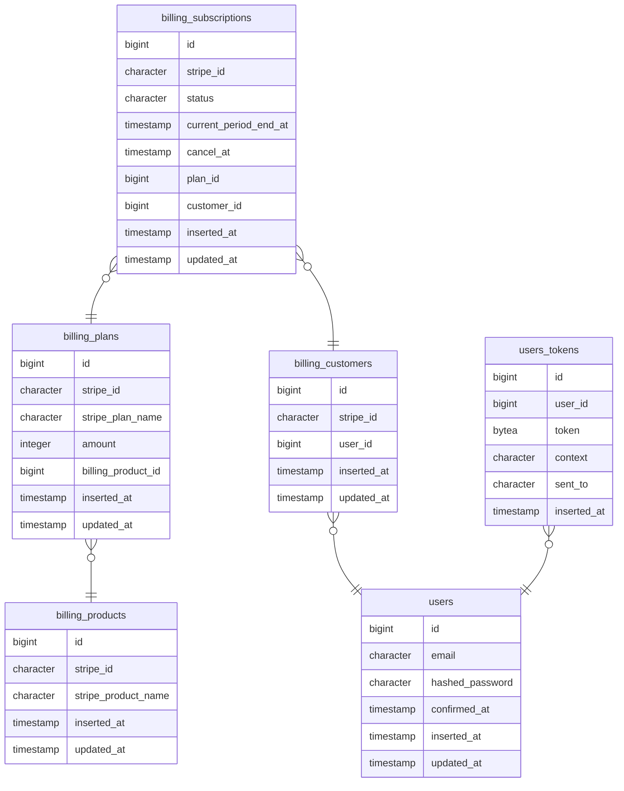
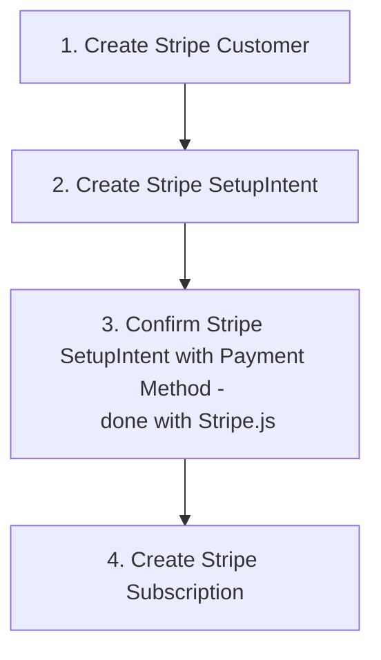

<div id="top"></div>
<!-- HEADER -->
<div align="center">
  <h3 align="center">LiveView Stripe Online Store</h3>

  </p>
</div>

<!-- TABLE OF CONTENTS -->
<details>
  <summary>Table of Contents</summary>
  <ol>
    <li>
      <a href="#about-the-project">About The Project 📝</a>
      <ul>
        <li><a href="#about-the-project">Screenshots 	🖥</a></li>
        <li><a href="#pages">Pages 📄</a></li>
        <li><a href="#built-with">Built With 🛠</a></li>
      </ul>
    </li>
    <li>
      <a href="#getting-started">Getting Started 🏃</a>
      <ul>
        <li><a href="#prerequisites">Prerequisites 🔌	</a></li>
        <li><a href="#installation">Installation ⌨</a></li>
      </ul>
    </li>
    <li><a href="#database-architecture">Database architecture 🗂</a></li>
    <li><a href="#pci-flow">Stripe PCI Compliance Flow 💰</a></li>
    <li><a href="#commit-walkthrough">Commit Walkthrough 🔑</a></li>
    <li><a href="#license">License 🔒</a></li>
    <li><a href="#contact">Contact 📩</a></li>
  </ol>
</details>

<div id="about-the-project"></div>

<!-- ABOUT THE PROJECT -->

## About The Project

This project is a boilerplate for any online subscription business. It handles user registration, authentication, and billing through Stripe and can be utilized for pretty much any online business from this point. It utilizes `Phoenix PubSub` and `GenServer` and to keep the data stored in the local database in sync with Stripe.

### Screenshots 🖥


<div id="pages"></div>

### Pages 📄

- Pricing plans page
- Payment form page
- Active subscriptions only page
- User credentials update page
- Login page
- Register page
- Forgot Password? page

<p align="right">(<a href="#top">back to top</a>)</p>

<div id="built-with"></div>

### Built With 🛠

- **Postgres** - 14.2.0
- **erlang** - 24.2.1
- [**Elixir**](https://hexdocs.pm/elixir/Kernel.html) - 1.13.3-otp-24
- [**Phoenix**](https://hexdocs.pm/phoenix/Phoenix.html) - 1.6.6
- [**Phoenix LiveView**](https://hexdocs.pm/phoenix_live_view/Phoenix.LiveView.html) - 0.1.75
- **NodeJS** - 16.2.0
- [**TailwindCSS**](https://tailwindcss.com/docs/installation) - 3.0.23
- [**Stripe JS**](https://stripe.com/docs/js)
- [**stripity_stripe**](https://hexdocs.pm/stripity_stripe/readme.html) - 2.13.0

<p align="right">(<a href="#top">back to top</a>)</p>

<!-- GETTING STARTED -->
<div id="getting-started"></div>

## Getting Started 🏃

To get a local copy up and running follow these simple steps.

<div id="prerequisites"></div>

### Prerequisites 🔌

1. Install `erlang`, `Elixir`, `NodeJS`, `Postgres` and `stripe/stripe-cli/stripe`.

   1. With homebrew the commands are:

   ```zsh
    brew update
    brew install erlang elixir nodejs postgres stripe/stripe-cli/stripe
   ```

   2. Or if you prefer `asdf`

   ```zsh
    brew update
    brew install asdf postgres stripe/stripe-cli/stripe

    asdf plugin-add erlang
    asdf plugin-add elixir
    asdf plugin-add nodejs

    asdf install erlang latest
    asdf install elixir latest
    asdf install nodejs latest

    asdf global erlang latest
    asdf global elixir latest
    asdf global nodejs latest
   ```

2. Sign up for a Stripe developer's account here [here](https://dashboard.stripe.com/register) to get your API keys.

   1. From there you will have to create 2 different products each with two prices.
      This can be done by going to the Stripe UI dashboard and clicking on Products and then clicking on the blue "Add Product" button.
      I used what is below.

   ```
   Product 1
   Name: Standard
   Price 1: $150/year
   Price 2: $15/month

   Product 2
   Name: Premium
   Price 1: $300/year
   Price 2: $30/month
   ```

3. Login to the Stripe CLI - `stripe login`

<div id="installation"></div>

### Installation ⌨

1. Run the command `stripe listen --forward-to localhost:4000/webhooks/stripe`, in a terminal window.
   1. Note: this window will have to be kept open the entire time your app is running, you should see a similar message to what is below in your terminal.
    > `⡿ Getting ready... > Ready! You are using Stripe API Version [XXX]. Your webhook signing secret is <YOUR KEY> (^C to quit)`

2.  Clone this Repo and enter the directory.
    1. `git clone https://github.com/herbedev/live_view_stripe && cd live_view_stripe`
3.  Install dependencies with `mix deps.get`.
4.  Install npm assets.
    1. `cd assets && npm ci && cd ../`
5.  Create and migrate your database with `mix ecto.setup`
6.  Setup env variables by running the commands provided in `.env.example` in your terminal with your keys.
    1. `STRIPE_WEBHOOK_SIGNING_KEY` comes from step 1.
    2. `STRIPE_SECRET` and `STRIPE_PUBLISHABLE` come from the Stripe Dashboard.
7.  Start Phoenix server with `iex -S mix phx.server`
    1. Now you can visit [`localhost:4000`](http://localhost:4000) from your browser.
8.  Sync Products and Plans by running these commands inside of the IEX session for the server. (Same terminal you ran the previous step) Order is important.
    1. `LiveViewStripe.SyncProducts.run`
    2. `LiveViewStripe.SyncPlans.run`
9.  Now you can visit `http://localhost:4000` in your browser and you will see the app running.

> You can run unit tests with the command `mix test`


<p align="right">(<a href="#top">back to top</a>)</p>

<div id="database-architecture"></div>

## Database architecture 🗂



Made with [Mermaid.js](https://github.blog/2022-02-14-include-diagrams-markdown-files-mermaid/)

<div id="pci-flow"></div>

## Stripe PCI Compliant Flow 💰

- https://stripe.com/docs/security/guide



1. Stripe Customer have a 1:1 relationship with users in your app, on user registration a Stripe Customer is generated.
2. On mount of the payment form LiveView, a Stripe setupIntent is created for the current user.
3. On submit of the payment form; Stripe JS is used to confirm that setupIntent and stay PCI compliant.
4. Once the the setupIntent is confirmed, Stripe will attach the payment method the corresponding customer for the setup intent.
5. An event is forwarded from the Stripe CLI  and handled on the `/webooks` post route.
6. Based on the event pushed to the post route, a variety of actions are taken.

Made with [Mermaid.js](https://github.blog/2022-02-14-include-diagrams-markdown-files-mermaid/)

<p align="right">(<a href="#top">back to top</a>)</p>

<!-- Commit Walkthrough -->
<div id="commit-walkthrough"></div>

## Commit Walkthrough 🔑

I grouped my commits into 10 sections to make it easier to follow.  Each commit
message is prefaced with a number,

ex: `[ 1 ] Commit Message Goes Here`

that number corresponds with a step number below.

<hr>

1. I used the commands:
   1.  `mix phx.new LiveViewStripe` and `mix phx.gen.auth Accounts User users`
   2.  To generate the project that we are going to use along with the user authentication skeleton.
2. Since I want to sync my local database with what is on Stripe - I used the following commands to generate schemas, migrations, contexts and tests for `Customer`, `Plan`, `Product` and `Subscription` with only a few small adjustments made.

```
# Command 1
mix phx.gen.context Billing Product products --table billing_products stripe_id stripe_product_name
# Command 2
mix phx.gen.context Billing Plan plans --table billing_plans billing_product_id:references:billing_products stripe_id stripe_plan_name amount:integer
# Command 3
mix phx.gen.context Billing Customer customers --table billing_customers user_id:references users
# Command 4
mix phx.gen.context Billing Subscription subscriptions --table billing_subscriptions plan_id:references:billing_plans customer_id:references:billing_customers stripe_id status current_period_end_at:naive_datetime cancel_at:naive_datetime
```

3. I am working with a service that will not be available when my tests are running; therefore, I have to create a `MockStripe` service that will return equivalent responses to what Stripe JS or `stripity_stripe` would return.
4. Next I need a few services to sync both `Products` and `Plans` with my local database in the case `products/prices` are modified or additional `prices/products` are created through the Stripe Developer's Dashboard.
   > This is also needed for the initial setup as well.
5. My local database holds all the important of each Stripe object, I have already created functions to sync plans and products; so it only makes sense to create a Stripe customer on successful user registration. This service takes care of creating the stripe customer.
6. This is where the terminal forwarding webhooks from stripe to our server comes in to play.
   1. I will need to create a `post` route to handle the information being forwarded to our app from the Stripe CLI.
   2. I also need to `construct` a `Stripe.Event` and notify all subscribers to the channel of the event.
7. The billing context got a little out of hand; I need to refactor the context and the tests to break everything out into one of `Customer`, `Plan`, `Product` or `Subscription` modules.
8. I need a way to display different subscriptions plans to the public and let them choose which one is perfect for them.
   - Create a parent LiveView `page_live`.
   - Create a LiveComponent `product_component`- is the contents of the pricing page and was made a LiveComponent for easy reuse.
   - Add the route for this LiveView to the router.

9. I need a payment form to collect and verify the payment information for our customer, I also need a page that is only viewable to members with an active subscription..
   - Create the Members only LiveView and route.
   - Create `Plug` `:require_active_subscription` for members only route.
   - Create New Subscription LiveView and route.
   - Phoenix hook to handle Stripe payments with Stripe.JS in order to stay PCI compliant.

10.  The default phoenix styles aren't that great, lets implement Tailwind CSS and give these pages a facelift.

<p align="right">(<a href="#top">back to top</a>)</p>

<!-- LICENSE -->
<div id="license"></div>

## License 🔒

Distributed under the MIT License. See `LICENSE.txt` for more information.

<p align="right">(<a href="#top">back to top</a>)</p>

<!-- CONTACT -->
<div id="contact"></div>

## Contact 📩

John Herbener - [herbener.cloud](https://herbener.cloud) - john@herbener.cloud |
Project Link: [https://github.com/herbedev/live_view_stripe](https://github.com/herbedev/live_view_stripe)

<p align="right">(<a href="#top">back to top</a>)</p>
